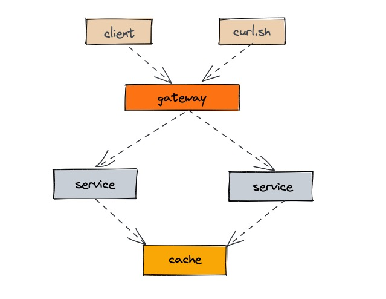
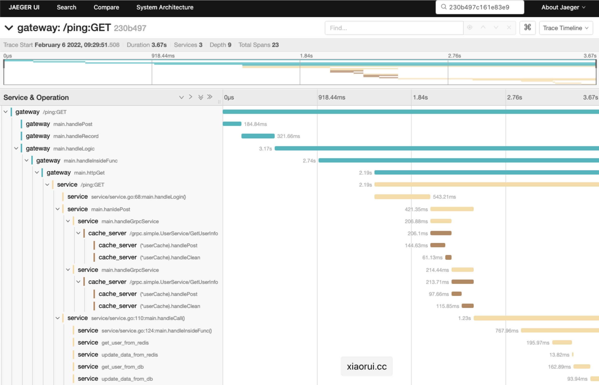

## tracer

simple trace sdk for OpenTracing and OpenTelemetry.

[uber jaeger kit install document](./docs/jaeger_install.md)

### Feature:

support component:

- simple api
- http middleware
- grpc middleware
- redis hook
- function span
- goroutine stack caller cache
- sorted TraceID generator

### OpenTelemetry Usage:

#### init tracer

```go
import (
	"github.com/rfyiamcool/go-tracer/otel"
)

func main() {
	tp, err := otel.New(serviceName, otel.WithMode(otel.ModeCollectorHttp), otel.WithAddress(url), otel.WithQueueSize(3000))
	if err != nil {
		log.Fatal(err)
	}
	defer tp.Shutdown(context.Background())

	...
}
```

#### start span

```go
func hanldePost(ctx context.Context) {
	cctx, span := otel.StartSpan(ctx, "post")
	defer span.End()

	handleGrpcService(cctx, 1111)
}

func handleGrpcService(ctx context.Context, uid int) {
	cctx, span := otel.StartSpan(ctx, "handleGrpcService")
	defer span.End()

	// inject header, fill biz header
	md := metadata.Pairs("key-111", "val-111")
	md.Set("key-222", "val-222")

	// request
	var rheader metadata.MD
	resp, err := gclient.GetUserInfo(
		cctx,
		&pb.UserRequest{ID: int32(uid)},
		grpc.Header(&rheader),
	)

	// tag
	span.SetAttributes("method", "GetUserInfo")

	// log
	span.AddEventa("req.uid", uid)
	span.AddEventa("resp.body", md)
	span.AddEventa("resp.body", resp)
	span.AddEventa("resp.error", err)

	if err != nil {
		fmt.Println("grpc request failed, err: ", err.Error())
		return
	}
}
```

### OpenTracing Usage:

#### init tracer

```go
func NewTracer(serviceName string, addr string, fns ...optionFunc) (opentracing.Tracer, io.Closer, error) {
```

#### start span

```go
func handleLogic(ctx context.Context, params interface{}) error {
	span, cctx := tracer.StartSpanFromContext(ctx, tracer.GetFunc())
	defer func() {
		span.SetTag("request", params)
		span.Finish()
	}()

	resp, err := httpGet(cctx, "http://127.0.0.1:8181/ping", map[string]interface{}{"k1": "v1"})
	if err != nil {
		return err
	}

	return nil
}

func httpGet(ctx context.Context, url string, data map[string]interface{}) (*req.Resp, error) {
	span, _ := tracer.StartSpanFromContext(ctx, tracer.GetFunc())
	defer func() {
		span.SetTag("url", url)
		span.Finish()
	}()

	header := make(http.Header, 10)
	err := tracer.InjectHttpHeader(span, header)
	if err != nil {
		span.LogFields(tracer.LogString("inject-error", err.Error()))
	}

	resp, err := req.Get(url, header)
	return resp, err
}
```

#### gin middleware

```go
r := gin.Default()
r.Use(tracer.TracingMiddleware(serviceName))
r.GET("/ping", handlePing)
r.Run(bindAddr)
```

#### grpc server interceptor

```go
listener, err := net.Listen("tcp", bindAddr)
grpcServer := grpc.NewServer(tracer.GrpcServerOption())
grpcServer.Serve(listener)
```

`For more usage, please see the code !!!`

### OpenTracing Example 

[tracer code example](http://git.hualala.com/gopkg/tracer/example/)

#### request path:



- client
- gateway
- service
- cache

#### start jaeger `all in one` container

```sh
bash example/start_jaeger.sh
```

#### start servers

1. go run example/gateway/gw.go --trace-addr=127.0.0.1:6381
2. go run example/service/service.go --trace-addr=127.0.0.1:6381
3. go run example/cache/cache.go --trace-addr=127.0.0.1:6381

#### send request to gateway

Three ways to start the client !!!

- go run example/client/client.go --trace-addr=127.0.0.1:6381
- bash example/curl.sh, http request with custom x-trace-id.
- curl -vvv 127.0.0.1:8080/ping

```sh
$ > bash example/curl.sh

x-trace-id ===>  230b497c161e83e9:230b497c161e83e9:0000000000000000:1

*   Trying 127.0.0.1:8080...
* Connected to 127.0.0.1 (127.0.0.1) port 8080 (#0)
> GET /ping HTTP/1.1
> Host: 127.0.0.1:8080
> User-Agent: curl/7.71.1
> Accept: */*
> x-trace-id: 230b497c161e83e9:230b497c161e83e9:0000000000000000:1

* Mark bundle as not supporting multiuse
< HTTP/1.1 200 OK
< Content-Type: application/json; charset=utf-8
< Span-Id: 07f59dea1f92f1dd
< Trace-Id: 230b497c161e83e9
< Date: Sun, 06 Feb 2022 01:29:55 GMT
< Content-Length: 18
<
* Connection #0 to host 127.0.0.1 left intact

{"message":"pong"}%
```

Starting processes one by one is very cumbersome, you can use `goreman` start these processes, ‎😃 oh, what is `goreman`? how to use `goreman`? click the project > [https://github.com/mattn/goreman](https://github.com/mattn/goreman)

```sh
go install github.com/mattn/goreman@latest

cat Procfile
goreman -f Procfile start
```

#### query trace in UI

1. open `http://${jaeger_query_addr}:16686/search` in chrome browser.
2. input trace-id in jaeger ui.



### OpenTelemetry Example 

Please follow `opentracing` Example Usage.

```sh
cd otel

cat Procfile
goreman -f Procfile start
```